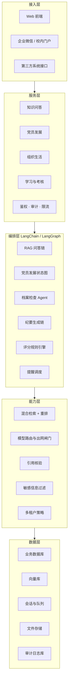
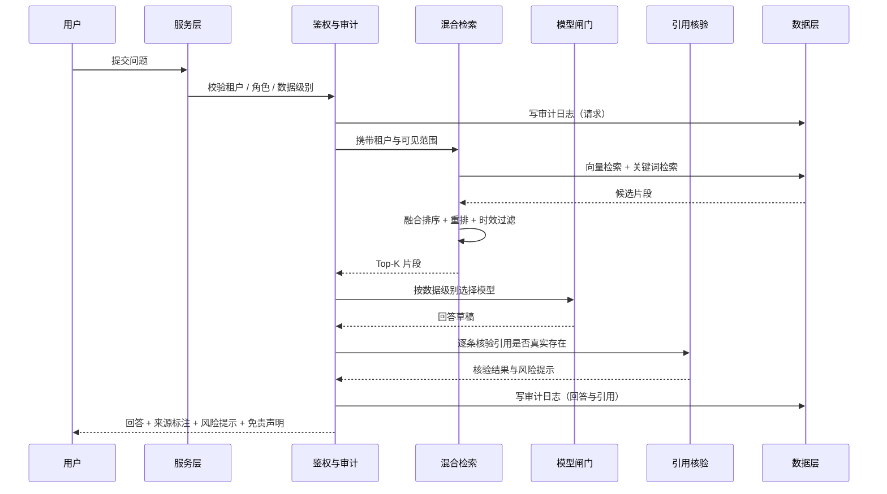
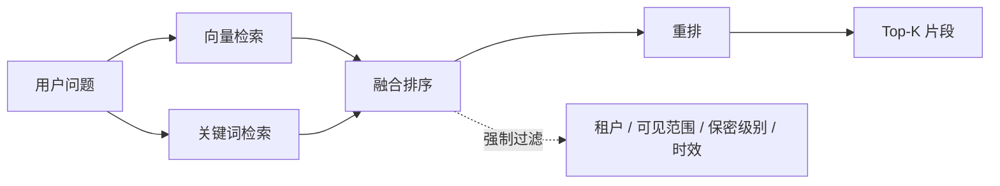
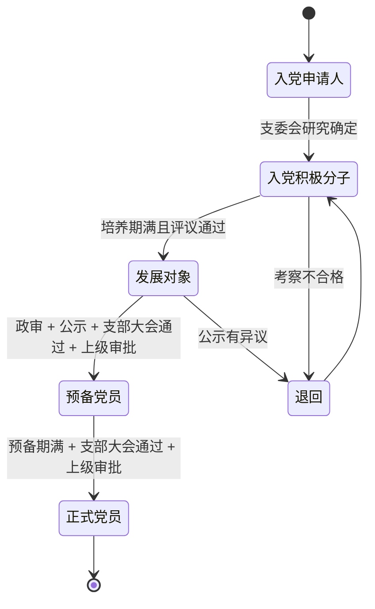
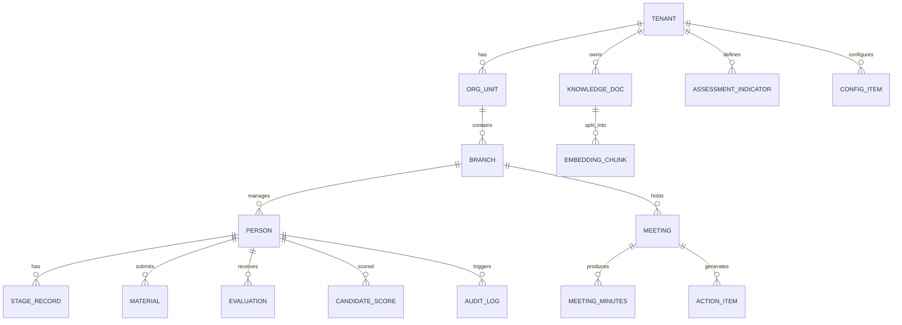
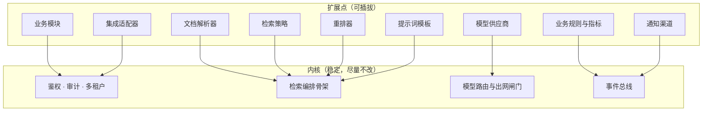
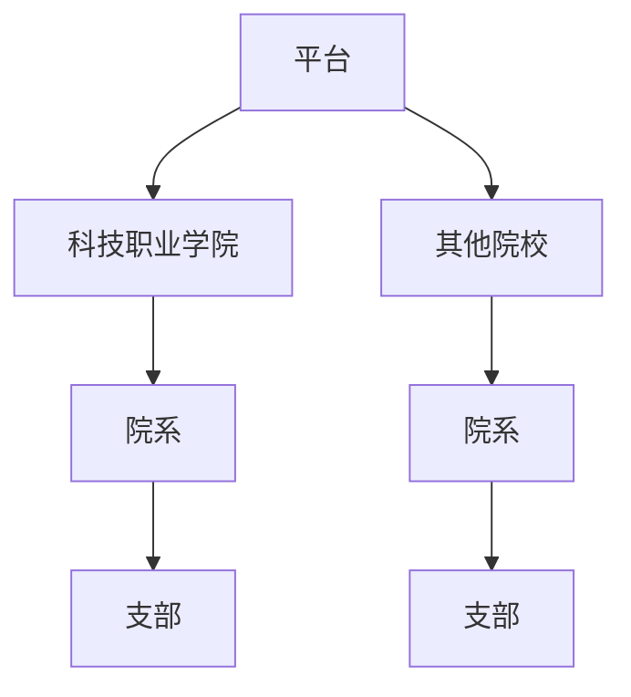

# 高校党建工作智能体 · LangChain 项目框架文档

## 文档信息

| 项目 | 内容 |
| --- | --- |
| 文档名称 | 高校党建工作智能体 LangChain 项目框架文档 |
| 文档版本 | V1.1 |
| 编制日期 | 2026-10-09 |
| 编制依据 | 《党建工作智能体需求总结》（require.txt） |
| 项目阶段 | **项目框架确定阶段** |
| 文档性质 | 框架与设计约定文档，**不含实现代码**；代码在框架评审通过后另行编写 |
| 覆盖范围 | 仅覆盖 LangChain 产品化路径，不含扣子原型阶段搭建细节 |
| 目标读者 | 项目组、技术负责人、湘潭大学评审专家、信息化与保密管理部门 |
| 保密级别 | 内部资料（不含真实人员数据） |

### 修订记录

| 版本 | 日期 | 修订内容 | 修订人 |
| --- | --- | --- | --- |
| V1.0 | 2026-10-09 | 首次成文，覆盖技术选型、架构、模块实现、部署与测试 | 项目组 |
| V1.1 | 2026-10-09 | 按"项目框架确定"要求调整：移除全部实现代码，改为框架、接口契约与设计约定；补充可扩展性设计（第 15 章） | 项目组 |

> **文档使用说明**：本文档用于确认项目框架。所有内容描述"系统由哪些部分组成、各部分承担什么职责、彼此如何约定"，**不描述具体代码如何书写**。实现细节在框架评审通过后，于开发阶段的详细设计文档中展开。

---

## 目录

1. [项目定位与范围](#1-项目定位与范围)
2. [技术选型与版本策略](#2-技术选型与版本策略)
3. [总体架构](#3-总体架构)
4. [工程结构规划](#4-工程结构规划)
5. [核心模块框架设计](#5-核心模块框架设计)
6. [提示词工程框架](#6-提示词工程框架)
7. [数据模型与存储框架](#7-数据模型与存储框架)
8. [服务接口框架](#8-服务接口框架)
9. [权限与多租户框架](#9-权限与多租户框架)
10. [安全合规框架](#10-安全合规框架)
11. [部署与运维框架](#11-部署与运维框架)
12. [测试与评测框架](#12-测试与评测框架)
13. [开发计划与里程碑](#13-开发计划与里程碑)
14. [风险与应对](#14-风险与应对)
15. [可扩展性与演进设计](#15-可扩展性与演进设计)
16. [附录](#16-附录)

---

## 1 项目定位与范围

### 1.1 本项目的定位

项目整体路径为 **"扣子平台原型验证 → 需求评审确认 → LangChain 产品化开发 → 多校推广"**。

本文档负责其中**产品化阶段的项目框架**：确定技术底座、系统分层、模块边界、接口契约与安全约束，作为后续详细设计与开发的依据。

### 1.2 为什么选 LangChain

| 需求来源 | 对框架的要求 | LangChain 的对应能力 |
| --- | --- | --- |
| 知识问答需基于权威材料、可溯源 | 检索增强生成（RAG）全链路可编排 | 文档加载、切分、检索、输出解析的统一抽象 |
| 党员发展是长流程、多阶段、有状态 | 有状态流程编排、可中断可恢复 | **LangGraph** 状态图 + 状态持久化 |
| 档案检查、材料核验需多步推理 | 工具调用与多步 Agent | 工具调用、Agent 执行器 |
| 高算力功能需切换模型、控成本 | 模型可插拔、可路由 | 统一的模型抽象接口 |
| 私有化部署、数据不出校 | 本地模型与本地向量库可接入 | 支持本地推理服务与本地向量库 |
| 输出需引用核验、敏感过滤、人工审核 | 可插入自定义中间环节 | 可组合的链式编排 + 回调机制 |

### 1.3 框架层面的三条边界

以下三条是**框架级红线**，在架构设计阶段即固化为机制，不依赖开发人员的自觉：

| 编号 | 边界 | 落实层面 |
| --- | --- | --- |
| B1 | 智能体仅提供辅助分析，不作任何组织认定、选拔或结论 | 流程状态图不设"写结论"环节；结论类输出统一挂载免责声明并强制进入人工审核 |
| B2 | 涉密与敏感材料不得发送至未经批准的公网大模型 | 模型调用统一经过出网闸门，闸门位于链路必经处，不可绕过 |
| B3 | 电子记录的合规性与效力以学校组织部门确认为前提 | 归档类功能由合规开关控制，未确认时功能关闭并给出提示 |

### 1.4 覆盖范围与不覆盖范围

**框架覆盖：** 知识库与检索、知识问答、党员发展全流程、组织生活与"三会一课"、中心组学习、党建考核与年度规划、多租户与权限、安全合规、部署形态、测试与评测、可扩展机制。

**框架不覆盖：** 具体代码实现、前端界面设计、扣子原型阶段细节、学校内部审批流程本身。

---

## 2 技术选型与版本策略

### 2.1 选型清单

| 层次 | 选型 | 选择理由 |
| --- | --- | --- |
| 开发语言 | Python 3.11 / 3.12 | 生态兼容性与长期维护性优先 |
| 编排框架 | **LangChain** | 链式编排，RAG 全链路组件齐备 |
| 流程编排 | **LangGraph** | 有状态流程、可中断可恢复、支持子图嵌套 |
| 模型服务 | 通义千问 / 开源模型（本地推理服务） | 按数据级别与算力需求分流 |
| 向量化模型 | 中文优化 Embedding 模型，本地部署 | 文档不出网 |
| 向量库 | **PostgreSQL + pgvector** | 与业务库同构，降低运维复杂度 |
| 关键词检索 | PostgreSQL 中文全文检索 | 与向量检索组成混合召回 |
| 重排序 | 交叉编码器重排模型，本地部署 | 提升精确率，降低幻觉 |
| 关系库 | PostgreSQL | 业务数据、配置、审计日志 |
| 缓存与队列 | Redis | 会话上下文、异步任务、提醒调度 |
| 服务框架 | FastAPI | 标准 REST 接口，便于校内系统对接 |
| 部署方式 | 容器化，支持单机私有化起步 | 适配学校既有服务器环境 |
| 可观测 | 结构化日志 + 审计库 + 调用链追踪 | 满足审计与排障要求 |

### 2.2 依赖构成（按用途分类）

> 仅列依赖构成与用途，具体版本在开发阶段以**锁定文件**形式固化。

| 用途 | 依赖类别 | 说明 |
| --- | --- | --- |
| 链式编排 | LangChain 核心与社区包 | 链接口、提示词模板、输出解析 |
| 流程编排 | LangGraph | 状态图、状态持久化、工具循环 |
| 模型接入 | 通义千问 SDK、OpenAI 兼容接口客户端、本地推理客户端 | 按供应商分别接入 |
| 向量与检索 | pgvector 集成包、向量库驱动、本地向量化与重排库 | 检索链路的底层支撑 |
| 服务与数据 | Web 框架、参数校验、ORM 与迁移工具、缓存客户端、任务调度 | 服务化与数据访问 |
| 文档解析 | PDF、Word 等格式解析库 | 知识库入库 |
| 评测与测试 | 单元测试框架、检索与生成评测库 | 质量保障 |

### 2.3 版本策略

| 策略 | 要求 |
| --- | --- |
| 锁定版本 | 所有依赖版本写入锁定文件并纳入版本管理 |
| 禁止浮动 | 生产环境安装一律使用锁定文件，不使用浮动版本 |
| 升级受控 | 升级依赖前须跑通回归评测集，通过后方可合并 |
| 模型版本固定 | 模型版本作为配置项固定，灰度验证后再全量切换 |
| 变更留痕 | 每次依赖或模型变更记录原因、影响面与回归结果 |

### 2.4 模型路由策略

按"数据级别"与"任务类型"两个维度决定使用哪个模型：

| 场景 | 数据级别 | 模型选择 |
| --- | --- | --- |
| 公共知识库问答 | 公开 | 成本优先的外部模型 |
| 校内私有库问答 | 内部 | 私有化部署模型（不出网） |
| 党员材料分析、评分辅助 | 敏感 | **强制私有化模型** |
| 档案合规检查 | 敏感 | **强制私有化模型** |
| 会议纪要、主题生成 | 内部 / 敏感 | 优先开源模型或经批准的通义千问 |
| 向量化与重排 | 全级别 | 一律本地部署 |

**框架约束：**

- 模型清单由配置管理，不在代码中写死供应商与型号。
- 所有模型调用必须经过统一的出网闸门；闸门依据数据级别判定是否放行。
- 敏感及以上级别若未配置私有化模型，调用被拒并记录审计，**不降级为外部模型**。
- 新增模型供应商只需在注册表登记并按配置生效，不改动业务链路。

---

## 3 总体架构

### 3.1 分层架构



### 3.2 请求主链路（以知识问答为例）



### 3.3 架构设计原则

| 编号 | 原则 | 落地要求 |
| --- | --- | --- |
| P1 | 检索先于生成 | 强制走检索增强；无检索依据时走拒答分支，不给模型自由发挥空间 |
| P2 | 引用可核验 | 回答生成后回查引用是否真实存在，核验失败即剔除并记风险 |
| P3 | 时效优先 | 检索默认排除已失效文件；查询历史政策需显式开关并给出提示 |
| P4 | 租户强隔离 | 租户条件在检索层与数据访问层双重强制注入，不依赖业务代码传参 |
| P5 | 数据分级驱动 | 数据级别决定模型路由、脱敏策略、是否需人工审核 |
| P6 | 决策留痕 | 评分与结论类输出必须附带依据；无法提供依据的内容不予输出 |
| P7 | 扩展友好 | 模块、模型、检索器、提示词、业务规则一律以"注册机制 + 配置"接入 |
| P8 | 配置优于代码 | 时限、权重、指标、提示词、模型清单等易变项一律外置为配置 |

### 3.4 编排层与业务层的分工

| 层 | 负责 | 不负责 |
| --- | --- | --- |
| 编排层 | 检索、生成、核验、状态流转建议、工具调用 | 权限判定、数据落库、审计 |
| 业务层 | 权限、数据读写、审计、配置读取、事务 | 直接调用模型 |
| 能力层 | 检索策略、模型路由、脱敏、核验 | 业务语义判断 |

---

## 4 工程结构规划

### 4.1 目录职责

```text
party-agent/
├── app/
│   ├── main.py                 应用入口，负责模块登记与装载
│   ├── config.py               全局配置定义
│   ├── deps.py                 依赖注入（会话 / 当前用户 / 租户）
│   ├── api/                    接口层：路由、中间件
│   ├── modules/                业务模块（可按需新增）
│   ├── chains/                 编排层：链与状态图
│   ├── rag/                    检索链路：解析、切分、检索、重排、核验
│   ├── llm/                    模型接入：注册表、路由、出网闸门
│   ├── rules/                  业务规则：评分、提醒、档案校验
│   ├── events/                 事件总线与跨模块联动
│   ├── integrations/           外部系统适配层
│   ├── services/               业务服务（非模型部分）
│   ├── models/                 数据模型定义
│   ├── schemas/                接口出入参定义
│   └── prompts/                提示词模板与版本登记
├── migrations/                 数据库迁移脚本
├── tests/                      单元、集成、安全、评测
├── config/                     运行配置（模型路由、检索策略、集成开关）
└── deploy/                     部署编排与初始化脚本
```

### 4.2 结构约定

| 约定 | 说明 |
| --- | --- |
| 模块自治 | 每个业务模块拥有独立的接口、服务、数据模型与规则，禁止跨模块直接引用内部实现 |
| 内核稳定 | 鉴权、审计、租户、检索骨架、模型闸门属于内核，业务扩展不修改内核 |
| 单向依赖 | 模块间通过服务接口或事件通信，禁止循环依赖 |
| 配置外置 | 运行时可变的参数不进入代码，统一放配置或数据库 |
| 提示词独立 | 提示词与代码分离，便于版本管理与灰度 |

---

## 5 核心模块框架设计

### 5.1 配置与参数中心

统一管理运行期可变项，按层级回退：**当前租户 → 上级租户 → 全局默认**。

| 配置域 | 内容 | 生效方式 |
| --- | --- | --- |
| 检索策略 | 初检条数、重排保留数、无依据阈值、是否排除失效文件 | 运行时热生效 |
| 模型路由 | 数据级别 / 任务 → 模型 | 运行时热生效 |
| 合规开关 | 外部模型白名单、敏感出网开关、电子记录合规确认 | 需管理员操作，变更留痕 |
| 业务规则 | 阶段时限、提醒规则、评分权重、考核指标 | 运行时热生效 |
| 集成开关 | 人员数据来源、校内系统对接方式 | 需重启或显式刷新 |

**框架要求：** 所有配置项必须有明确默认值；合规类开关默认取"最严格"值。

### 5.2 知识文档加载与元数据规范

#### 5.2.1 元数据必填项

知识文档入库前必须携带完整元数据，这是引用溯源与时效过滤的基础。

| 字段 | 必填 | 说明 |
| --- | --- | --- |
| 文档标识 | 是 | 全局唯一 |
| 文件名称 | 是 | 用于引用展示 |
| 发文单位 | 是 | 用于权威性判断 |
| 文号 | 否 | 用于精确引用 |
| 层级 | 是 | 中央 / 省级 / 校级 / 院系级 |
| 归属租户 | 是 | 公共库固定为平台标识 |
| 可见范围 | 是 | 公开 / 校级 / 院系级 / 支部级 |
| 保密级别 | 是 | 公开 / 内部 / 敏感 / 涉密 |
| 生效日期 | 是 | 用于时效判断 |
| 失效日期 | 否 | 为空表示长期有效 |
| 文件状态 | 是 | 有效 / 已废止 |
| 主题标签 | 是 | 发展党员 / 组织生活 / 学习 / 考核等 |

#### 5.2.2 入库校验规则

| 规则 | 说明 |
| --- | --- |
| 必填项缺失即拒绝入库 | 不允许"先入库后补元数据" |
| 涉密材料不入向量库 | 涉密材料仅可留存于经批准的本地环境，走人工归档流程 |
| 中央级文件必须标注公开密级 | 防止内部材料被误标为公开 |
| 文件解析器按格式注册 | 新增格式只需注册解析器，不改动入库流程 |

### 5.3 知识切分策略

| 策略 | 说明 |
| --- | --- |
| 优先结构切分 | 按"章—条"结构切分，保持条款完整，避免语义截断 |
| 超长二次切分 | 单条超过阈值时按中文标点层级二次切分，保留重叠区 |
| 保留条款编号 | 片段携带条款编号，作为引用核验的依据 |
| 携带父级信息 | 片段继承文档级元数据，并保留片段顺序 |
| 抽检机制 | 切分结果按比例抽检人工核对，纳入评测流程 |

**可配置项：** 片段长度上限、重叠长度、是否启用二次切分。

### 5.4 混合检索框架

单路检索在中文字号、专有名词（如"三会一课""政审"）上召回不稳定，采用**向量检索 + 关键词检索**双路召回，再融合排序。



**强制过滤条件（在检索层注入，业务代码不可绕过）：**

| 过滤项 | 条件 |
| --- | --- |
| 租户 | 仅命中"公共库 + 当前租户" |
| 可见范围 | 由用户角色推导 |
| 保密级别 | 由用户角色推导，不接收外部传入 |
| 文件状态 | 排除已废止 |
| 有效期 | 默认排除已失效；历史查询需显式开启 |

**可配置项：** 初检条数、融合算法参数、是否启用关键词路、时效过滤开关。

### 5.5 重排与无依据判定

| 环节 | 设计要求 |
| --- | --- |
| 重排 | 对融合后的候选做交叉编码器重排，输出带分数的排序结果 |
| 无依据判定 | 最高分低于阈值即判定"无依据"，链路直接进入拒答分支 |
| 拒答话术 | 明确告知"知识库中未找到直接依据，建议向上一级党组织确认" |
| 阈值调整 | 阈值可配置；调整后必须重跑评测集 |

**框架要求：** 无依据判定必须发生在生成之前，避免模型在缺乏依据时自由作答。

### 5.6 知识问答链框架

链路分为六个阶段，每阶段的输入输出契约固定：

| 阶段 | 职责 | 输入 | 输出 |
| --- | --- | --- | --- |
| 1 预处理 | 多轮追问改写为独立问题 | 会话上下文 + 当前问题 | 独立问题 |
| 2 检索 | 混合召回 + 强制过滤 | 独立问题 + 租户与权限上下文 | 候选片段 |
| 3 重排判定 | 重排并判定是否有依据 | 候选片段 | Top-K 片段 + 有依据标记 |
| 4 生成 | 依据片段生成回答 | 片段 + 提示词模板 | 回答草稿 |
| 5 引用核验 | 核验引用编号与条款真实性 | 回答草稿 + 片段 | 清洗后回答 + 引用列表 + 风险提示 |
| 6 输出 | 组装统一响应 | 上述结果 | 回答 + 引用 + 风险 + 免责声明 |

**统一响应必须包含：** 回答正文、引用列表（含文件名、文号、条款、发文单位、生效日期、适用范围）、风险提示列表、免责声明。

**拒答分支：** 阶段 3 判定无依据时跳过阶段 4、5，直接输出固定拒答文案与检索到的候选文件供人工查阅。

### 5.7 引用核验框架

| 核验项 | 判定 | 处理 |
| --- | --- | --- |
| 引用编号有效性 | 编号是否落在检索片段范围内 | 无效编号从答案中移除并记风险 |
| 条款真实性 | 答案提及的条款号是否存在于被引片段 | 不存在则记风险，提示人工复核 |
| 文件时效 | 被引文件是否已废止或即将失效 | 给出失效提示 |
| 引用完整性 | 长回答是否标注了来源 | 未标注则记风险 |
| 无依据长回答 | 无引用却给出实质性结论 | 标记风险，提示谨慎采信 |

### 5.8 多轮会话框架

| 要求 | 说明 |
| --- | --- |
| 会话隔离 | 会话键包含租户标识，防跨租户串话 |
| 上下文范围 | 仅保留问答内容与引用摘要，**不保留原始敏感片段** |
| 追问改写 | 追问先改写为独立问题再检索，提升召回质量 |
| 过期策略 | 会话有效期可配置，到期自动清理 |
| 审计 | 会话中的提问与回答一并进入审计 |

### 5.9 党员发展全流程框架

#### 5.9.1 流程状态图



#### 5.9.2 阶段规则（全部配置化）

| 当前阶段 | 拟转入 | 必需材料（示例项，配置化） | 最短时限 |
| --- | --- | --- | --- |
| 入党申请人 | 入党积极分子 | 入党申请书、党组织谈话记录 | 按学校规定 |
| 入党积极分子 | 发展对象 | 思想汇报、培养考察记录、群众评议材料、党课培训证明 | 培养期上限可配置 |
| 发展对象 | 预备党员 | 政治审查材料、公示情况报告、支部大会决议、上级审批意见 | 按学校规定 |
| 预备党员 | 正式党员 | 转正申请书、预备期考察记录、支部大会决议 | 预备期上限可配置 |

#### 5.9.3 状态图职责与决策边界

| 状态图内的环节 | 职责 | 禁止事项 |
| --- | --- | --- |
| 资格校验 | 核对材料齐全性与时限满足情况，输出阻断项 | 不得修改人员阶段 |
| 待办生成 | 生成"待补材料""建议安排会议"等行动建议 | 不得派人、不得代发通知 |
| 流转建议 | 生成"拟转入什么阶段、需履行什么程序"的建议 | **不得写入阶段字段** |

> **框架级约束：** 状态图中**不存在任何写入阶段字段的环节**。人员阶段变更只能通过人工接口，由具备权限的组织人员依规操作，并记录决策人、决策时间与依据。

#### 5.9.4 关键节点提醒框架

| 提醒类别 | 触发依据 | 提醒对象 | 渠道 |
| --- | --- | --- | --- |
| 培养期满 | 进入阶段日期 + 时限配置 | 培养联系人、支部书记 | 系统消息 |
| 材料提交 | 阶段起始日期 + 提前量 | 本人、培养联系人 | 系统消息 |
| 会议讨论 | 支部会议计划 | 支部书记 | 系统消息 |
| 公示 | 公示期起止 | 支部书记 | 系统消息 |
| 政审 | 材料准备节点 | 本人、组织员 | 系统消息 |
| 转正 | 预备期满前提前量 | 本人、支部书记 | 系统消息 |

**要求：** 提前量、触发条件、通知对象、渠道**全部可配置**；支持批量导出提醒清单；提醒记录进入审计。

#### 5.9.5 选优辅助评分框架

| 维度 | 权重（可配置） | 数据来源 | 证据要求 |
| --- | --- | --- | --- |
| 理论测试成绩 | 可配置 | 培训记录 | 必须注明成绩来源 |
| 志愿服务时长 | 可配置 | 志愿服务台账 | 必须注明累计时长与统计区间 |
| 学业表现 | 可配置 | 教务数据 | 必须注明绩点与挂科情况 |
| 群众评议 | 可配置 | 群众评议会记录 | 必须注明满意率与评议时间 |
| 党员意见 | 可配置 | 支部党员大会记录 | 必须注明评议得分与会议时间 |

**框架要求：**

- 每项分值必须附带证据说明；**无证据的维度直接跳过，不予打分**。
- 硬性风险项（挂科、处分等）单独提示，不参与加权，须人工核实。
- 输出统一附带免责声明，明确"不构成任何组织认定或选拔结论"。
- 权重按租户、按批次可配，支持不同院系差异化。

#### 5.9.6 档案合规检查框架

| 维度 | 检查内容 | 输出 |
| --- | --- | --- |
| 材料完整性 | 对照清单核对缺项 | 缺失材料清单 |
| 手续规范性 | 签字、盖章、日期是否齐全 | 不规范项清单及判断依据 |
| 时间规范性 | 各阶段间隔、顺序、时限是否符合规定 | 异常时间点清单 |

**框架要求：** 以工具调用方式分步执行检查；输出分为"缺失项 / 不规范项 / 风险提示"三部分，每条须指出具体材料与判断依据；**只做检查与提示，不出具"合格 / 不合格"结论**。

### 5.10 组织生活与"三会一课"框架

#### 5.10.1 会议类型覆盖

支部党员大会、支部委员会、党小组会、党课、主题党日、民主 / 组织生活会。

#### 5.10.2 全流程辅助环节

| 阶段 | 辅助内容 | 依据 |
| --- | --- | --- |
| 计划 | 按上级要求与年度计划提示应召开会议 | 年度计划配置 |
| 准备 | 议题建议、学习材料推荐、会议通知与议程草案 | 知识库检索 |
| 进行 | 支持录音或文字记录（录音能力为扩展项） | 外部转写服务 |
| 会后 | 结构化纪要生成、任务事项抽取、材料归档 | 会议记录 |

#### 5.10.3 纪要结构化字段

| 字段 | 要求 |
| --- | --- |
| 会议基本信息 | 类型、时间、地点 |
| 参会与缺席人员 | 按原文列出，不确定填"待明确" |
| 议题列表 | 与议程对应 |
| 讨论要点 | 按议题归并，不得添加原文未提及内容 |
| 决议事项 | 仅记录会议中明确形成的内容 |
| 任务事项 | 含任务、责任人、完成时限；未提及填"待明确" |
| 原文摘录标记 | 涉及人员评价的内容原样保留并标注为原文摘录 |

#### 5.10.4 合规门禁

| 要求 | 说明 |
| --- | --- |
| 归档开关 | 电子记录合规性与效力经学校组织部门确认后方可启用归档 |
| 未确认时行为 | 归档接口拒绝服务并返回明确的合规提示文案 |
| 减负原则 | 一次录入、多处复用，避免"手写台账 + 重复电子录入" |
| 纸质过渡 | 需保留纸质原件的材料提供打印版与扫描上传通道 |

### 5.11 中心组学习框架

| 环节 | 辅助内容 |
| --- | --- |
| 年度安排 | 依据上级学习重点、重要时间节点、学校中心工作生成年度学习安排草案 |
| 主题推荐 | 按月度 / 季度推荐学习主题与依据文件 |
| 材料支持 | 从知识库推荐政策文件与参考材料，附摘要与要点提示 |
| 议程与提纲 | 生成学习议程与发言提纲参考，政策表述必须来自检索结果 |
| 纪要 | 生成学习纪要，提取学习要点、讨论共识、工作要求 |
| 归档 | 学习资料与历史记录归档，支持按年度 / 主题检索与材料导出 |

**框架要求：** 所有"依据文件"必须来自知识库检索结果，不得由模型自行概括或扩展；输出统一标注"供党委研究确定"。

### 5.12 党建考核与年度规划框架

#### 5.12.1 指标—数据源映射（配置化）

| 指标类别 | 数据来源模块 | 归集方式 |
| --- | --- | --- |
| 组织建设类 | 组织架构、支部建设数据 | 直接归集 |
| 党员发展类 | 党员发展模块 | 统计发展人数、材料完整率 |
| 组织生活类 | 组织生活模块 | 统计会议次数、参会率、记录完整率 |
| 理论学习类 | 中心组学习、党员学习模块 | 统计学习次数、参学率、纪要完整率 |
| 制度建设类 | 制度文件库 | 制度数量与更新情况 |
| 特色创新类 | 人工录入 | 项目与品牌数据 |

#### 5.12.2 指标归集输出要求

| 字段 | 说明 |
| --- | --- |
| 指标编码与名称 | 对应学校考核体系 |
| 考核要求 | 指标公式或判定条件 |
| 实际值 | 从业务模块自动计算 |
| 是否满足 | 布尔判定 |
| 佐证材料引用 | 指向源数据记录，供核查 |
| 缺项提示 | 缺少佐证时明确列出 |

**框架要求：** 数据一次录入、多处复用；同一数据被多个考核点自动引用；归集结果可导出为考核材料目录。

---

## 6 提示词工程框架

### 6.1 组织方式

| 要求 | 说明 |
| --- | --- |
| 与代码分离 | 提示词以模板文件形式独立存放 |
| 版本登记 | 每个提示词登记版本号与内容指纹 |
| 变更留痕 | 修改须记录版本、原因、影响的评测结果 |
| 灰度能力 | 支持按比例灰度，比对效果后再全量 |
| 回归要求 | 问答、评分、纪要三类提示词变更后必须重跑评测集 |

### 6.2 通用约束条款

所有生成类提示词共用以下约束：

| 约束 | 目的 |
| --- | --- |
| 只依据提供的参考资料作答 | 抑制幻觉 |
| 无依据时明确拒答 | 避免编造政策 |
| 逐条标注来源编号 | 保证可溯源 |
| 不代替党组织作出任何认定 | 守住决策边界 |
| 不输出党员个人敏感信息 | 数据保护 |
| 涉及时效文件须提示失效风险 | 避免引用过期政策 |
| 不确定信息填"待明确" | 禁止推测填充 |

### 6.3 提示词清单（框架级）

| 提示词 | 用途 | 关键约束 |
| --- | --- | --- |
| 问答系统提示词 | 知识问答 | 只依据资料、强制引用、无依据拒答 |
| 追问改写提示词 | 多轮会话 | 只输出改写后问句 |
| 议题生成提示词 | 会议准备 | 议题须注明依据，标注"供支部研究确定" |
| 材料推荐提示词 | 会议 / 学习准备 | 材料必须来自检索结果 |
| 纪要整理提示词 | 会议纪要 | 不得补充原文未提及内容，不确定填"待明确" |
| 学习计划提示词 | 中心组学习 | 与上级重点对应，标注"供党委研究确定" |
| 发言提纲提示词 | 中心组学习 | 政策表述不得脱离参考资料 |
| 档案检查提示词 | 档案合规 | 只检查不结论 |

---

## 7 数据模型与存储框架

### 7.1 实体关系



### 7.2 主要数据表（框架级）

| 分组 | 表 | 说明 |
| --- | --- | --- |
| 组织 | 租户、组织单元、支部 | 支持多级归属，租户树形结构 |
| 人员 | 人员、阶段流转记录、材料、评价记录、辅助评分结果 | 阶段变更须记录决策人与依据 |
| 会议 | 会议、会议纪要、会议任务 | 纪要须标记是否经人工审核 |
| 知识 | 知识文档、向量片段 | 文档携带完整元数据 |
| 考核 | 考核指标、考核任务、指标归集结果 | 指标与佐证材料可追溯 |
| 配置 | 配置项、提示词版本、规则配置 | 支持租户级覆盖 |
| 安全 | 审计日志、审核任务 | 审计只追加不修改 |

### 7.3 存储设计要求

| 要求 | 说明 |
| --- | --- |
| 向量库扩展 | 数据库须启用向量扩展 |
| 中文分词 | 须配置中文全文检索分词，支撑关键词召回 |
| 审计表只追加 | 审计表禁止更新与删除，由数据库权限保证 |
| 软删除 | 业务数据统一软删除，物理删除走审批 |
| 备份加密 | 数据库与文件备份均加密存储 |
| 分区预留 | 大表预留按租户或时间的分区方案 |

---

## 8 服务接口框架

### 8.1 接口清单

| 分组 | 接口 | 说明 |
| --- | --- | --- |
| 问答 | 知识问答、流式问答 | 返回回答 + 引用 + 风险 + 免责声明 |
| 知识库 | 文档上传、文档更新与失效、知识检索 | 上传须携带完整元数据 |
| 党员发展 | 人员查询、资格校验、阶段流转、提醒查询、辅助评分 | 阶段流转为人工操作，权限受控 |
| 档案 | 档案合规检查 | 输出三类清单 |
| 组织生活 | 议题生成、材料推荐、纪要生成、会议归档 | 归档受合规开关控制 |
| 学习 | 年度计划、发言提纲 | 输出标注"供研究确定" |
| 考核 | 指标归集、任务清单、材料导出 | 附佐证材料引用 |
| 管理 | 审计日志查询、配置管理、提示词管理 | 限管理员角色 |

### 8.2 统一约定

| 约定 | 说明 |
| --- | --- |
| 租户来源 | 租户标识从登录态解析，**不接收前端传入** |
| 数据级别 | 由用户角色推导，不接收前端传入 |
| 生成类响应结构 | 统一包含回答正文、引用列表、风险提示、免责声明 |
| 结论类响应结构 | 统一包含结论内容、依据列表、审核状态、免责声明 |
| 分页与错误 | 统一分页参数与错误码规范 |
| 幂等 | 写操作支持幂等键，防重复提交 |

### 8.3 接口权限要求

| 接口类别 | 最低权限 |
| --- | --- |
| 知识问答 | 登录用户 |
| 知识库维护 | 院系级及以上管理员 |
| 党员发展查询 | 支部书记及以上 |
| 阶段流转 | 支部书记及以上，且操作留痕 |
| 辅助评分 | 支部书记及以上 |
| 会议归档 | 支部书记及以上，且合规开关开启 |
| 配置与审计 | 系统管理员 |

---

## 9 权限与多租户框架

### 9.1 角色与数据范围

采用"角色 + 数据范围"双层模型：

| 角色 | 知识库可见范围 | 业务数据范围 | 主要操作 |
| --- | --- | --- | --- |
| 系统管理员 | 全部 | 全部（以脱敏统计为主） | 租户配置、权限分配、审计查询 |
| 学校级管理员 | 公共 + 本校 | 全校 | 本校知识库维护、指标配置 |
| 院系级管理员 | 公共 + 本校 + 本院系 | 本院系 | 院系知识库维护、院系统计 |
| 支部书记 / 组织员 | 公共 + 本校 + 本院系 + 本支部 | 本支部 | 支部数据维护、发起流转申请 |
| 普通党员 | 公共 + 本校 | 本人 | 问答、查本人信息、提交材料 |
| 申请人 / 积极分子 | 公共 | 本人 | 问答、提交材料 |

### 9.2 隔离设计要求

| 要求 | 说明 |
| --- | --- |
| 检索层强制过滤 | 租户与可见范围条件在检索层注入，业务代码无法绕过 |
| 数据访问层强制过滤 | 数据访问层自动补齐租户条件，禁止手工拼接 |
| 公共库与私有库分离 | 公共库以平台标识存储，写入严格分离、检索并集命中 |
| 越权测试 | 越权访问专项测试纳入持续集成卡点 |
| 租户级配置 | 配置按租户覆盖，支持"集团统一 + 学校个性化" |

### 9.3 脱敏要求

| 对象 | 要求 |
| --- | --- |
| 身份证号、手机号、各类编号 | 输出与日志中自动脱敏 |
| 政治表现、群众评议原文 | 按角色最小授权，默认不对普通用户展示 |
| 投票明细 | 仅在具备权限的统计场景使用 |
| 出网前处理 | 敏感级别调用外部模型前统一走脱敏与拦截 |

---

## 10 安全合规框架

### 10.1 需求条款与框架机制对应

| 需求条款 | 框架机制 | 落地位置 |
| --- | --- | --- |
| 人员档案、政治表现、投票等分类分级 | 保密级别字段 + 检索过滤 + 角色可见范围 | 数据模型与检索层 |
| 按学校 / 院系 / 支部 / 角色设访问权限 | 角色与数据范围双层模型 | 权限框架 |
| 涉密敏感材料不得发往公网模型 | 出网闸门 + 白名单配置 | 模型路由 |
| 数据加密、访问日志、操作审计、备份删除 | 传输与存储加密、审计库、备份策略、删除审批 | 部署与运维 |
| 公共库与私有库数据边界 | 租户标识 + 检索强制过滤 | 检索层 |
| 输出引用核验、敏感过滤、人工审核 | 引用核验环节 + 脱敏 + 审核队列 | 编排层与业务层 |
| 评分与选优保留评价依据 | 证据强制字段，无证据不打分 | 规则层 |
| 上线前三方审核 | 合规开关 + 审核留痕 | 配置与流程 |

### 10.2 审计要求

| 要求 | 说明 |
| --- | --- |
| 覆盖范围 | 全部业务模块接口，不因新增模块而遗漏 |
| 记录内容 | 操作人、时间、动作、对象、数据级别、结果、来源地址 |
| 敏感操作加强 | 权限变更、数据导出、配置修改、阶段流转额外记录变更前后值 |
| 存储要求 | 独立存储、只追加、保留期不少于一年 |
| 查询能力 | 支持按用户、时间、对象、动作检索 |
| 告警 | 异常操作（越权、批量导出、异常登录）触发告警 |

### 10.3 人工审核要求

| 场景 | 要求 |
| --- | --- |
| 纳入审核 | 辅助评分、选优建议、党员发展结论类建议、考核评价结果、重要材料生成 |
| 流程 | 提交后标记"待审核"，通知审核人，通过后方可对外使用 |
| 留痕 | 保留审核人、审核时间、审核意见 |
| 状态可见 | 未审核内容在界面明确标注状态 |

### 10.4 降级策略

| 场景 | 降级行为 |
| --- | --- |
| 模型服务不可用 | 问答降级为"仅返回检索结果与来源"，不返回生成内容 |
| 外部模型不可用 | 敏感链路本就使用私有模型，不受影响；公共问答降级为检索模式 |
| 高算力任务排队 | 异步处理，给出明确进度反馈 |
| 平台资源受限 | 任务顺延，保留断点以便续测 |

---

## 11 部署与运维框架

### 11.1 部署形态

| 形态 | 适用场景 | 说明 |
| --- | --- | --- |
| 单机容器化 | 单校试点、演示 | 一台服务器承载全部组件，最简私有化 |
| 内网集群 | 多院系并发 | 应用多副本 + 独立数据库与模型服务 |
| 混合部署 | 需外部模型辅助 | 敏感链路走内网，公共问答可调用经批准的外部模型 |

### 11.2 组件构成

| 组件 | 作用 | 部署要求 |
| --- | --- | --- |
| 应用服务 | 提供接口与编排逻辑 | 可多副本 |
| 数据库 | 业务数据、配置、审计 | 启用向量与中文分词扩展 |
| 缓存与队列 | 会话、异步任务、调度 | 持久化开启 |
| 向量化与重排服务 | 本地向量化与重排 | 本地部署 |
| 私有化模型服务 | 敏感链路推理 | 需 GPU，本地部署 |
| 文件存储 | 原始文档与归档材料 | 加密存储 |

### 11.3 运维要求

| 项 | 要求 |
| --- | --- |
| 网络暴露 | 数据库、模型服务端口仅绑定本地或内网，不对外暴露 |
| 备份 | 数据库与向量库定期备份，备份加密、异地存放 |
| 监控 | 接口时延、模型调用成功率、检索命中率、审核队列积压量 |
| 日志 | 应用日志与审计日志分离存储 |
| 灰度 | 模型与提示词变更支持灰度 |
| 应急 | 制定模型不可用、数据异常、越权事件三类应急预案 |

---

## 12 测试与评测框架

### 12.1 测试分层

| 层次 | 范围 | 通过标准 |
| --- | --- | --- |
| 单元测试 | 切分、元数据校验、融合排序、引用核验、评分规则、提醒规则 | 覆盖率达标 |
| 集成测试 | 检索链路、问答链路、状态图、接口 | 全部通过 |
| 检索评测 | 召回率、排序质量、重排增益 | 达到设定阈值 |
| 生成评测 | 忠实度、答案相关性、引用正确率 | 达到设定阈值 |
| 安全测试 | 越权访问、敏感数据出网、异常输入 | 无高危问题 |
| 性能测试 | 并发问答、批量评分、批量查询 | 达到非功能指标 |

### 12.2 评测集要求

| 项 | 要求 |
| --- | --- |
| 规模 | 不少于 200 条问答对，覆盖全部业务模块 |
| 内容 | 问题、标准要点、标准依据文件与条款、是否应拒答 |
| 拒答样本 | 不少于 30 条知识库确无依据的样本 |
| 时效样本 | 不少于 20 条过期政策样本 |
| 维护 | 政策更新后同步更新评测集 |

### 12.3 验收指标

| 阶段 | 指标 | 目标 |
| --- | --- | --- |
| 第一阶段 | 回答政策依据人工核对正确率 | ≥ 90% |
| 第一阶段 | 引用可追溯率 | 100% |
| 第一阶段 | 过期政策识别率 | ≥ 95% |
| 第一阶段 | 应拒答样本正确拒答率 | ≥ 95% |
| 第二阶段 | 节点提醒不遗漏率 | 100% |
| 第二阶段 | 辅助评分证据可追溯率 | 100% |
| 第二阶段 | 档案检查缺项识别准确率 | ≥ 90% |
| 第三阶段 | 多租户越权访问事件 | 0 起 |
| 第三阶段 | 敏感数据出网事件 | 0 起 |
| 第三阶段 | 问答端到端时延（P95） | ≤ 3 秒（不含高算力任务） |

---

## 13 开发计划与里程碑

> 时间以需求确认（湘潭大学老师评审通过）为起点 T0。

| 里程碑 | 内容 | 主要交付物 | 关键依赖 |
| --- | --- | --- | --- |
| M0 | 需求与框架确认 | 需求基线、**框架评审通过**、模型可接入清单、合规边界结论 | 湘潭大学评审、组织 / 信息化 / 保密部门意见 |
| M1 | 工程骨架与基础设施 | 仓库与持续集成、数据库与向量库、模型服务、模块注册机制 | M0 |
| M2 | 知识库与检索框架落地 | 入库规范、切分策略、混合检索、重排与无依据判定、引用核验 | M1、权威文件素材 |
| M3 | 知识问答助手上线 | 问答接口与前端接入、评测报告 | M2、评测集 |
| M4 | 党员发展闭环 | 状态图、提醒调度、评分规则、档案检查 | M3 |
| M5 | 组织生活与三会一课 | 议题、材料、议程、纪要、任务抽取 | M4、电子记录合规确认 |
| M6 | 学习与考核模块 | 学习计划与提纲、指标归集、材料导出 | M5 |
| M7 | 多租户与私有化 | 租户隔离、私有化部署包、完整安全审计 | M6、三方审核通过 |

### 13.1 各里程碑验收要点

| 里程碑 | 验收要点 |
| --- | --- |
| M0 | 框架文档评审通过；三条边界（B1–B3）获得各方认可 |
| M1 | 基础设施可跑通；模块登记与装载机制可用；配置中心可用 |
| M3 | 评测集各项指标达标；拒答与时效提示可用；引用可定位到原文 |
| M4 | 状态图不可自动改变阶段（代码审查确认）；评分每项有证据；提醒无遗漏 |
| M5 | 纪要须经人工审核方可使用；归档功能受合规开关控制 |
| M7 | 渗透测试无高危项；三方审核意见闭环 |

---

## 14 风险与应对

### 14.1 技术风险

| 编号 | 风险 | 影响 | 应对 |
| --- | --- | --- | --- |
| T-01 | 中文政策文本切分破坏条款完整性 | 引用不准 | 按章条结构切分；抽检核对；纳入评测 |
| T-02 | 混合检索召回不稳定 | 答非所问 | 双路召回 + 融合 + 重排；建立检索评测集持续回归 |
| T-03 | 模型幻觉编造条款 | 误导用户、合规风险 | 强制检索增强 + 引用核验 + 无依据拒答 + 阈值调优 |
| T-04 | 私有化模型效果弱于外部模型 | 体验下降 | 选用中文能力强的开源模型；必要时敏感链路降级为"检索 + 人工撰写" |
| T-05 | 多租户隔离实现不严 | 数据泄露 | 检索与数据访问双层强制过滤；专项越权测试；代码审查卡点 |
| T-06 | 流程状态持久化异常 | 业务中断 | 状态持久化到数据库并备份；提供流程看板与人工重置通道 |
| T-07 | 依赖升级导致行为变化 | 回归失败 | 锁定版本；升级必须跑通回归评测集 |
| T-08 | 原型迁移到产品化后行为不一致 | 用户困惑 | 保留原型阶段提示词与测试用例，迁移后逐条比对 |

### 14.2 合规与业务风险

| 编号 | 风险 | 影响 | 应对 |
| --- | --- | --- | --- |
| C-01 | 电子记录效力未获确认 | 归档功能无法上线 | 合规开关控制；未确认前功能关闭并提示 |
| C-02 | 敏感数据误发外部模型 | 严重安全事故 | 出网闸门统一拦截；出网请求全量记录 |
| C-03 | 评分结果被当作决策结论 | 组织程序风险 | 强制免责声明与证据链；界面标注"仅供参考"；进入人工审核 |
| C-04 | 基层负担未减轻反而增加 | 推广受阻 | 数据一次录入多处复用；上线前做真实支部减负测算 |
| C-05 | 知识库内容本身不合规 | 连带风险 | 入库前安全审查；定期复查；建立下架流程 |

### 14.3 项目风险

| 编号 | 风险 | 影响 | 应对 |
| --- | --- | --- | --- |
| P-01 | 需求在多轮评审中膨胀 | 进度延期 | 建立需求基线与变更评审流程 |
| P-02 | 算力资源不足 | 高算力功能不可用 | 优先开源模型；异步队列削峰；按需触发 |
| P-03 | 权威文件素材获取慢 | 知识库质量不足 | 提前建立素材通道；先增量上线 |
| P-04 | 框架阶段过度设计或设计不足 | 后期返工 | 扩展点接口先定、实现后补；每个里程碑回顾一次 |

---

## 15 可扩展性与演进设计

> **前提**：本项目不是一次性交付系统，后续必然持续拓展——新增业务模块、新增学校租户、更换模型、对接更多校内系统。本章定义"怎样拓展"的机制与约束，确保拓展成本随时间**下降**而非上升。

### 15.1 扩展场景预判

| 编号 | 扩展方向 | 典型场景 | 设计应对 |
| --- | --- | --- | --- |
| X-01 | 业务模块扩展 | 党费管理、主题教育、意识形态工作责任制、统战工作、干部工作 | 模块注册机制（15.4） |
| X-02 | 组织层级扩展 | 单校 → 多校 → 教育集团 → 跨校联合支部 | 租户树形模型 + 租户级配置（15.7） |
| X-03 | 知识库扩展 | 上级下发文件库、多校共建共享库、外部权威源 | 知识源可插拔 + 联邦检索预留（15.7） |
| X-04 | 模型扩展 | 新增供应商、私有模型升级、多模态、降本 | 模型注册表 + 配置驱动路由（15.5） |
| X-05 | 能力扩展 | 语音转写、纸质材料识别、移动端、小程序、多智能体 | 能力适配层 + 编排扩展（15.9） |
| X-06 | 集成扩展 | 对接党务系统、人事系统、教务系统、OA、企业微信 | 开放接口 + 适配层（15.10） |
| X-07 | 数据规模扩展 | 人员上万、文档上万、并发上升 | 分阶段扩容触发条件（15.11） |
| X-08 | 交付形态扩展 | 私有化交付 → "私有化 + SaaS 双轨" | 配置与代码分离 + 租户级隔离（15.7） |
| X-09 | 规则与指标扩展 | 考核指标调整、权重变化、各校时限差异 | 规则全量配置化（15.6） |

### 15.2 扩展性设计原则

| 编号 | 原则 | 含义 | 反面做法 |
| --- | --- | --- | --- |
| E1 | 配置优于代码 | 时限、权重、指标、提示词、模型清单等易变项一律进配置 | 把培养期时限写死在逻辑里 |
| E2 | 契约优于实现 | 模块之间只依赖稳定接口，不依赖内部实现 | 考核模块直接调用党员发展模块的内部函数 |
| E3 | 注册优于分支 | 新增一类能力用"注册表 + 实现"方式，不用条件分支长链 | 按模型名称写一长串 if / else |
| E4 | 只增不改 | 数据模型与接口字段只新增不修改语义，废弃走弃用标记 | 直接改字段含义，导致历史数据被重新解释 |
| E5 | 单向依赖 | 模块间通过服务接口或事件通信，禁止循环依赖 | A 调 B，B 又调 A |
| E6 | 不变量优先 | 扩展不得突破安全合规与决策边界（见 15.12） | 为上线新模块临时关闭审计或引用核验 |

### 15.3 扩展点总览



| 扩展点 | 扩展方式 | 新增成本 |
| --- | --- | --- |
| 业务模块 | 实现统一模块契约并登记 | 新增模块目录，不动内核 |
| 文档解析器 | 登记"格式 → 解析器" | 一个解析器 |
| 检索策略 | 登记检索策略实现 | 一个策略 |
| 重排器 | 登记重排实现 | 一个实现 |
| 模型供应商 | 在注册表登记供应商 | 一个适配函数 + 一条路由配置 |
| 提示词 | 新增模板并登记版本 | 模板与登记项 |
| 业务规则与指标 | 后台配置，无需发版 | 零开发 |
| 通知渠道 | 实现通知接口并登记 | 一个实现 |
| 集成适配器 | 实现适配协议并登记 | 一个适配器 |

### 15.4 业务模块接入框架

#### 15.4.1 模块契约（框架级要求）

每个业务模块必须提供统一的自描述信息，内核只依赖这份描述，不依赖模块内部实现。模块契约需声明：

| 声明项 | 说明 |
| --- | --- |
| 模块标识与中文名 | 用于菜单、日志、审计 |
| 版本 | 模块独立演进 |
| 接口路由 | 模块对外接口入口 |
| 权限点 | 纳入统一权限体系 |
| 默认数据级别 | 决定脱敏、模型路由与审核要求 |
| 依赖模块 | 用于装载顺序与循环依赖检测 |
| 菜单配置 | 前端菜单由配置生成 |
| 定时任务 | 如提醒调度 |
| 事件发布与订阅 | 用于跨模块联动 |
| 装载入口 | 注册路由、权限、任务、事件订阅 |

#### 15.4.2 装载机制要求

| 要求 | 说明 |
| --- | --- |
| 集中登记 | 模块在统一入口登记，新增模块只追加登记项 |
| 依赖拓扑排序 | 按依赖关系确定装载顺序 |
| 循环依赖检测 | 检测到循环依赖直接报错，不允许启动 |
| 重复注册检测 | 同一模块重复注册报错 |
| 权限自动纳管 | 模块声明的权限点自动进入权限体系 |

#### 15.4.3 新模块接入检查清单（强制）

| 序号 | 检查项 | 说明 |
| --- | --- | --- |
| 1 | 声明数据级别 | 敏感及以上自动继承脱敏与出网拦截 |
| 2 | 声明权限点 | 不得自建鉴权体系 |
| 3 | 声明依赖模块 | 禁止隐式跨模块引用 |
| 4 | 写操作携带租户 | 由数据访问层自动补齐，禁止手工拼接 |
| 5 | 关键操作进审计 | 复用统一审计能力 |
| 6 | 生成类输出接引用核验 | 统一响应结构 |
| 7 | 结论类输出进人工审核 | 统一审核队列 |
| 8 | 提供单元测试与越权测试 | 纳入持续集成卡点 |

### 15.5 模型与检索能力的可插拔

#### 15.5.1 模型可插拔要求

| 要求 | 说明 |
| --- | --- |
| 供应商注册 | 供应商以注册方式接入，业务代码只依赖模型抽象，不依赖具体 SDK |
| 路由配置化 | "数据级别 + 任务 → 模型"由配置决定，切换模型不发版 |
| 闸门不可绕过 | 新增供应商同样必须经过出网闸门 |
| 模型标识留存 | 记录每次调用实际使用的模型，便于追溯与成本核算 |
| 降级明确 | 目标模型不可用时，按配置降级策略执行，不静默切换为外部模型 |

#### 15.5.2 检索能力可插拔要求

| 要求 | 说明 |
| --- | --- |
| 检索策略可替换 | 当前为混合检索，未来可切为联邦检索或外部知识源检索，仅需改配置 |
| 重排器可替换 | 本地重排与接口式重排可切换 |
| 向量化模型可更换 | 更换向量化模型时新旧向量不可混用，须支持并行重建与灰度切换 |
| 索引标识 | 向量记录携带所用向量化模型标识，便于按模型维度重算 |

#### 15.5.3 向量模型更换策略

| 步骤 | 要求 |
| --- | --- |
| 1 并行构建 | 新模型在旁路重建索引，不影响线上检索 |
| 2 并行检索 | 按标识过滤，比对新旧检索质量 |
| 3 达标切换 | 评测达标后切换默认模型 |
| 4 清理旧索引 | 确认稳定后清理旧向量 |

### 15.6 规则与配置驱动的业务参数

党建业务参数**因校而异、因年而异**，全部配置化，做到"改规则不发版"。

| 配置类别 | 可配置项 | 影响范围 |
| --- | --- | --- |
| 阶段时限 | 各阶段最短时长、提醒提前天数 | 党员发展流程 |
| 评分权重 | 各维度权重、归一化上限 | 选优辅助评分 |
| 硬性阻断项 | 挂科、处分等阻断条件 | 资格校验 |
| 提醒规则 | 触发条件、提前量、通知对象、渠道 | 节点提醒 |
| 考核指标 | 指标公式、佐证来源、权重 | 考核归集 |
| 可见范围策略 | 层级 → 可见范围映射 | 检索过滤 |
| 模型路由 | 数据级别 / 任务 → 模型 | 模型调用 |
| 提示词版本 | 模板版本、灰度比例 | 生成质量 |
| 集成开关 | 数据来源与对接方式 | 外部系统集成 |

**框架要求：** 配置支持租户级覆盖与层级回退；配置变更即时生效并留痕；配置项必须有默认值。

### 15.7 从单校到多校的演进路径

#### 15.7.1 租户模型



租户表支持父子归属，可表达"教育集团 → 学校 → 院系"多级结构；配置按"当前租户 → 上级租户 → 全局默认"逐级回退，天然支持"集团统一配置 + 学校个性化覆盖"。

#### 15.7.2 推广时的三类工作

| 类型 | 内容 | 是否需开发 |
| --- | --- | --- |
| 配置类 | 组织架构、角色分配、知识库、时限规则、考核指标 | 不需要，后台配置 |
| 数据类 | 历史人员数据、档案材料导入 | 不需要，走导入工具 |
| 代码类 | 特殊集成（如对接该校自有系统） | 需要，编写一个适配器 |

> 目标是让多校推广的边际成本主要是**配置工作量**，而非开发工作量。

#### 15.7.3 知识库共享策略演进

| 阶段 | 策略 |
| --- | --- |
| 单校 | 公共库 + 本校私有库 |
| 多校初期 | 各校独立，公共库统一维护，检索并集命中 |
| 多校成熟 | 支持跨校共建库（联邦检索），已预留检索策略扩展点，需配套权限与审计审批 |

### 15.8 数据模型与索引的演进策略

| 策略 | 做法 | 目的 |
| --- | --- | --- |
| 只增不改 | 新增字段可空并带默认值，不改旧字段语义 | 历史数据无需重新解释 |
| 弃用标记 | 字段或接口废弃时标记弃用版本，保留至少两个版本周期 | 平滑迁移 |
| 枚举外置 | 状态类字段用字符串 + 校验表，不用数据库枚举 | 新增状态不改表结构 |
| 迁移受控 | 迁移前后记录结构版本，禁止手改生产库 | 可回滚 |
| 软删除 | 统一软删除，物理删除走审批 | 合规留痕 |
| 向量并行 | 更换向量化模型时并行重建，达标后切换 | 避免停机重建 |

### 15.9 能力扩展路线

| 能力 | 现状 | 扩展方式 | 预留扩展点 |
| --- | --- | --- | --- |
| 语音转写（会议录音） | 未实现 | 接入本地转写服务 | 转写能力接口 |
| 纸质材料识别 | 未实现 | 接入本地文字识别服务 | 文档解析器扩展点 |
| 移动端 / 小程序 | 未实现 | 复用现有接口，仅新增前端 | 接口已按标准 REST 设计 |
| 多智能体协作 | 单链为主 | 在状态图中增加主管节点编排子图 | 状态图支持子图嵌套 |
| 公文生成（通知、报告） | 未实现 | 新增模块 + 模板库 | 模块注册机制 |
| 智能统计看板 | 部分 | 新增模块，订阅各模块事件 | 事件总线 |
| 外部知识源接入 | 未实现 | 新增解析器或检索策略 | 解析器 / 检索策略扩展点 |

### 15.10 系统集成与开放能力

#### 15.10.1 集成适配层

学校现有系统（党务、人事、教务、OA）接口风格各异，一律通过适配层隔离，**禁止业务代码直接调用外部接口**。

| 适配协议 | 用途 |
| --- | --- |
| 人员与组织数据源适配 | 从人事系统、班主任名册或导入文件获取人员与组织数据 |
| 校内党务系统适配 | 阶段流转数据推送、材料拉取 |
| 单点登录适配 | 对接校内统一身份认证 |

适配类型由配置决定，切换对接方式只需改配置。可选项如：无对接 / 文件导入 / 接口对接 / 数据库视图。

#### 15.10.2 开放能力

| 能力 | 形式 | 用途 |
| --- | --- | --- |
| 数据同步 | 标准接口 + 增量游标 | 与校内系统同步人员与组织 |
| 事件通知 | 回调通知 | 阶段流转、会议归档、考核完成后通知外部 |
| 事件订阅 | 内部事件总线 | 跨模块联动 |

> 事件总线是"数据一次录入、多处复用"的技术支撑，也是新增模块时无需改动既有模块的关键。

### 15.11 性能与规模的扩展触发条件

| 指标 | 预警阈值（建议） | 扩容动作 |
| --- | --- | --- |
| 问答端到端时延 | 超过目标值 | 增加推理副本、开启结果缓存、下调检索条数 |
| 向量检索时延 | 明显升高 | 建立向量索引、按租户分区 |
| 单表数据量 | 达到千万级 | 按租户分区、冷热分离 |
| 并发问答 | 达到并发上限 | 应用多副本 + 模型服务横向扩展 |
| 审计日志量 | 达到千万级 | 按时间分区、归档至文件存储 |
| 知识库文档数 | 达到数万 | 增量索引 + 按主题分层索引 |

规模演进路径：


> 每一步迁移的**前置条件**是：租户隔离、配置外置、模块注册机制在前一阶段已完成。这也是这些能力要在第一阶段就打好底子的原因。

### 15.12 扩展治理：不可降级的不变量

无论后续怎么拓展，以下五条**不可因扩展而妥协**。以自动化测试卡点与代码审查清单固化，不依赖人的自觉：

| 编号 | 不变量 | 守护方式 |
| --- | --- | --- |
| INV-1 | 涉密与敏感数据不出网 | 出网闸门位于模型调用必经路径；新增供应商同样受约束 |
| INV-2 | 每条实质性回答可溯源 | 统一响应结构强制包含引用；新增生成能力必须接入引用核验 |
| INV-3 | 智能体不代替党组织决策 | 结论类接口必须返回免责声明并进入人工审核；状态图禁止写阶段字段 |
| INV-4 | 全量关键操作留痕 | 审计能力覆盖全部模块接口；新模块接入检查清单强制项 |
| INV-5 | 租户数据强隔离 | 检索与数据访问双层强制过滤；越权测试纳入持续集成 |

**框架要求：** 这五条必须转化为可持续执行的自动化校验项，而不能只停留在文档约定。

### 15.13 扩展交付物与节奏建议

| 阶段 | 扩展相关交付物 |
| --- | --- |
| M1 | 模块注册机制、配置中心骨架、事件总线 |
| M2–M3 | 解析器 / 检索策略 / 重排器 / 模型供应商四类注册机制 |
| M4–M6 | 业务规则全量配置化、新模块接入检查清单、不变量校验项 |
| M7 | 集成适配层、开放接口、租户配置分级 |
| 持续 | 每新增一个模块，回顾一次扩展点是否够用，避免扩展点腐化 |

**节奏建议：** 扩展点只在**第一次真的要用**时补齐实现，但**接口与注册机制**必须在第一阶段就位。否则等到推广期再改，成本会从"加一个实现"变成"改一遍链路"。

---

## 16 附录

### 16.1 术语表

| 术语 | 说明 |
| --- | --- |
| LCEL | LangChain 表达式语言，用于组合链式流程 |
| 状态图 | LangGraph 中的有状态流程编排方式，支持中断与恢复 |
| 状态持久化 | 将流程状态保存至数据库，支持中断续跑 |
| RAG | 检索增强生成 |
| 融合排序 | 将多路召回结果合并排序的算法（如倒数排名融合） |
| 引用核验 | 校验模型输出的引用是否真实存在于检索上下文中的机制 |
| 出网闸门 | 模型调用前的统一检查点，按数据级别决定是否放行 |
| 三会一课 | 支部党员大会、支部委员会、党小组会及党课 |
| 政审 | 政治审查 |
| 租户 | 本系统中指独立的学校或院系 |
| 扩展点 | 架构中预留给未来能力接入的稳定接口位置 |

### 16.2 关键配置项清单

| 配置项 | 默认值 | 说明 |
| --- | --- | --- |
| 外部模型白名单 | 空 | 允许调用的外部模型清单，由审批结论确定 |
| 敏感数据出网开关 | 关闭 | 默认最严格，需显式审批开启 |
| 电子记录合规确认 | 否 | 未确认时归档功能关闭 |
| 无依据判定阈值 | 待定标 | 低于该值判定为无依据并拒答 |
| 默认排除失效文件 | 是 | 检索是否默认过滤已失效文件 |
| 初检条数 | 待定标 | 混合检索召回数量 |
| 重排保留条数 | 待定标 | 重排后进入生成的片段数量 |
| 会话有效期 | 待定 | 多轮会话上下文保留时长 |

### 16.3 参考资料

- 《中国共产党章程》
- 《中国共产党发展党员工作细则》
- 《中国共产党党员教育管理工作条例》
- 《中国共产党支部工作条例（试行）》
- 《关于新形势下党内政治生活的若干准则》
- LangChain / LangGraph 官方文档

### 16.4 待确认事项

| 编号 | 待确认事项 | 影响范围 | 需确认方 |
| --- | --- | --- | --- |
| Q1 | 可接入的外部大模型清单 | 模型路由白名单 | 信息化、保密管理部门 |
| Q2 | 敏感数据的脱敏规则与字段清单 | 脱敏策略 | 保密管理部门 |
| Q3 | 电子记录合规性与法定效力结论 | 归档功能开关 | 组织部门 |
| Q4 | 各学校党员发展阶段的时限规则差异 | 阶段规则配置 | 组织部门 |
| Q5 | 辅助评分的维度与权重 | 评分配置 | 组织部门、党务业务组 |
| Q6 | 现有党务系统的对接接口与数据格式 | 集成适配层 | 信息化部门 |
| Q7 | 年度党建考核指标的具体条目 | 考核归集 | 组织部门 |
| Q8 | 部署环境算力规格 | 私有化模型选型 | 信息化部门 |
| Q9 | 多租户推广时间表与首批推广范围 | 演进排期 | 项目组、各系部 |
| Q10 | 框架评审通过标准 | 里程碑 M0 | 评审专家 |

---

*文档结束。本文档为**项目框架确定稿**，仅定义系统组成、职责边界、接口契约与设计约束，不含实现代码。所有内容须在需求确认后，结合学校组织部门、信息化部门及保密管理部门的审核意见最终定稿；实现细节在框架评审通过后另行展开。*
